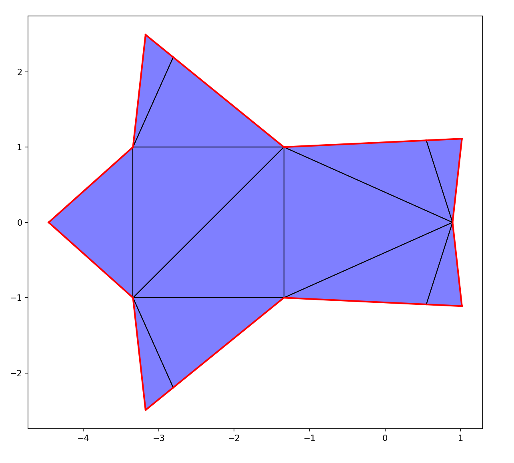
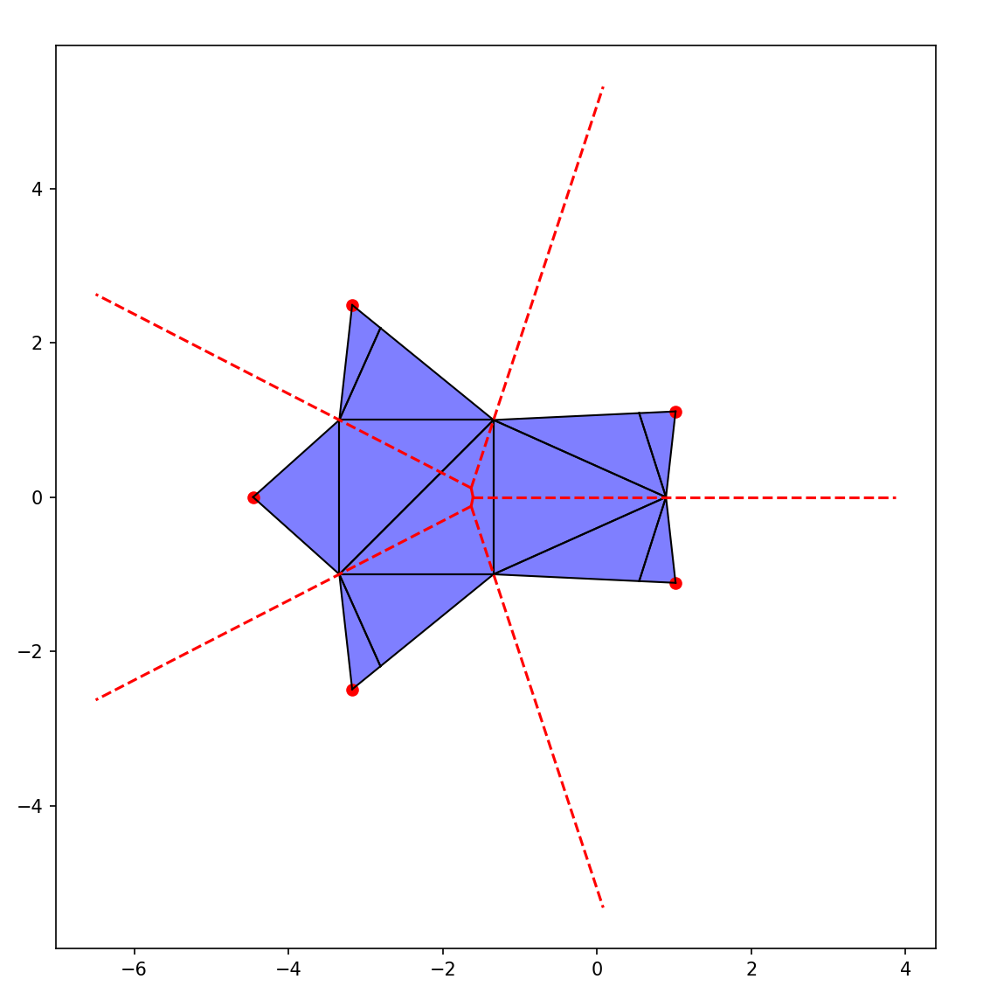
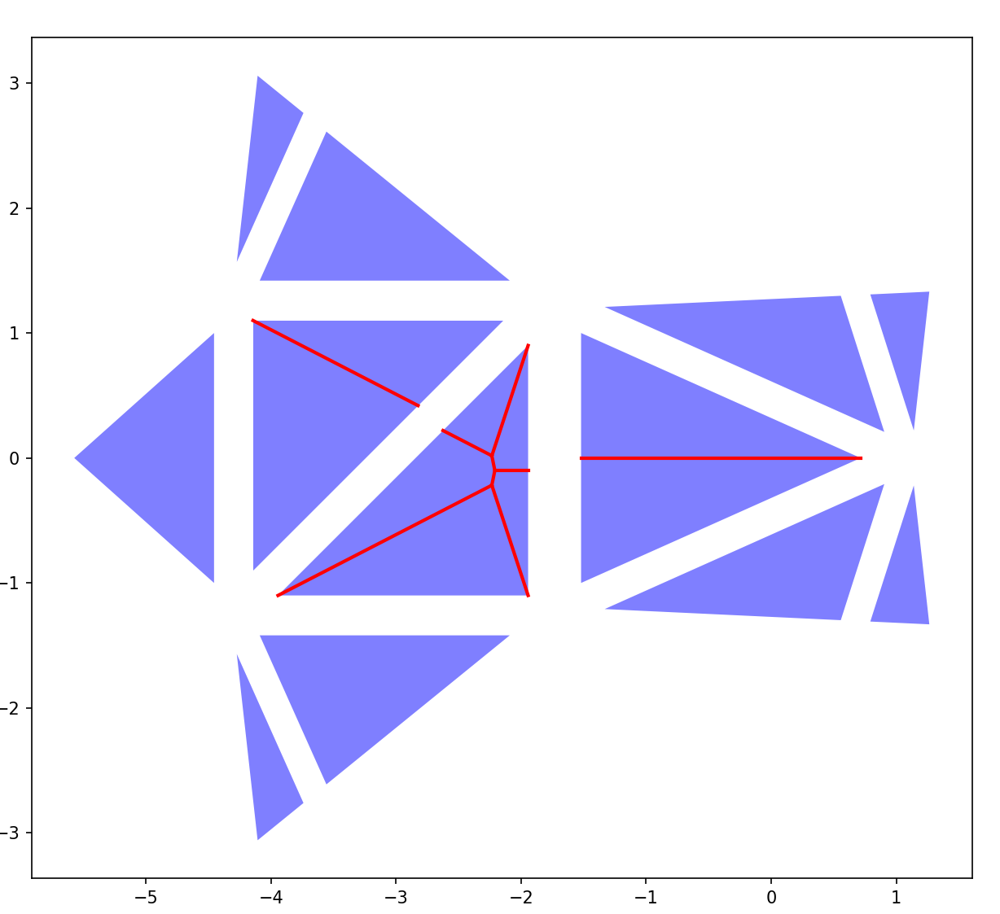

# SourceUnfolding
Python implementation of Source Unfolding.
In-depth assignment for the AlgorithmicFolding class at HPI Potsdam, WS2023/24.

### Setup
Tested with Python 3.11, does *not* work with 3.12. Older versions *might* work.

To install, run "pip install -r requirements.txt" in this folder.

### Usage
This repo contains two unfolding implementations: Source Unfolding and Star Unfolding (which is used for Source Unfolding).
You can get a quick demo of source unfolding by running "run.py".
To use them, import the respective classes (from "source_unfolding.py" or "star_unfolding.py") and instantiate an unfolding object:

~~~python
unfolding = SourceUnfolding(vertices, faces, source_point, show_intermediate_results=False, report_errors=False)
~~~
or
~~~python
unfolding = StarUnfolding(verts, faces, point)
~~~

both classes require a Mesh as vertices and face index array and a point that is inserted into the mesh to be used in either unfolding.
Source unfolding also allows you to enable debug visualizations and a verbose output mode.
To access the unfolded polygons, use
~~~python
unfolding.unfolded_polygons.values()
~~~

### Source Unfolding algorithm
The source unfolding of any convex mesh can be efficiently computed by first computing the star unfolding and then computing a voronoi diagram on the unfolded shape:

#### Step 0: Inserting the source point into the mesh
Before we can compute anything, we need to insert the source point that we want to use for our source unfolding into the mesh if it is not already there. There are three possible cases:
1. If the point is in the same location as one of the meshe's vertices, we reuse that point.
2. If the point lies on one edge of the mesh, we insert it into that edge by splitting the two triangles adjacent to the edge.
3. If the point lies inside one of the faces, we retriangulate the triangle into three new ones around that point.

If none of these cases are true, the point given is not valid (not on the surface of the mesh).

#### Step 1: Computing the Star Unfolding of the mesh
The star unfolding is the unfolding you get, when cutting from every vertex of the mesh to a single point along the shortest paths on the surface. The star unfolding is computed using the source point we inserted into our mesh in step 0. 

This picture shows the Star Unfolding we get when unfolding the pyramid mesh with the point on one of its triangular surfaces.

#### Step 2: Computing the voronoi tesselation of the source images of the star unfolding

We now use the unfolding we got in the last step to figure out all the locations, that our source point has been unfolded to. We call these locations the source images.
There are many of these, since we cut along many paths to this point. 

Using the source images, we can now create a voronoi diagram:

You might already see why this is useful, since all of these lines are the lines that have equal distance to two of the source images.

#### Step 3: Limiting the voronoi diagram to the unfolded polygons

The cut locus, that we want to find for our source unfolding is now all of the points on the voronoi lines that lie inside the unfolded shape of the star unfolding. 

To compute it, we intersect the lines with the unfolded polygons. We do this for each polyon individually, in order to keep track of which line segment lies on which polygon. This is helpful to be able to fold them back onto the shape in the next step. We also dilate the polygons by a tiny bit before the intersection, to deal with line segments running along the edges of the polygon.

#### Step 4: Fold the line segments of the cut locus back onto our 3D-mesh

We now fold the line segments back onto our 3D-mesh:

This is rather simple, since we already know which line is on which polygon. Now we can get the transformation that was used to unfold the respective polygon from our Star Unfolding object:
~~~python
star_unfolding.applied_transformations[face_id]
~~~
This is a matrix, and by inverting it we can revese the unfolding transformation and apply it to our line segments.

#### Step 5: Cutting along the cut locus and unfolding

Now, we create cut lines for the line segments by sequentially inserting all the points into the mesh (like in step 0). 
There are some cases where we can cross an edge that was created from retriangulating things, so we check if there are edges between the last and the current edge that we need to split (we can do this using the shortest path calculation used in star unfolding). To keep track, which faces should be disconnected when unfolding, we store the face pair along the edges of the cut locus in 
~~~
self.faces_to_separate
~~~
Then we can unfold:

We now have a Source Unfolding of our pyramid in all it's glory! :)

### Contact

Any questions? Contact julian.arnold@student.hpi.de.
